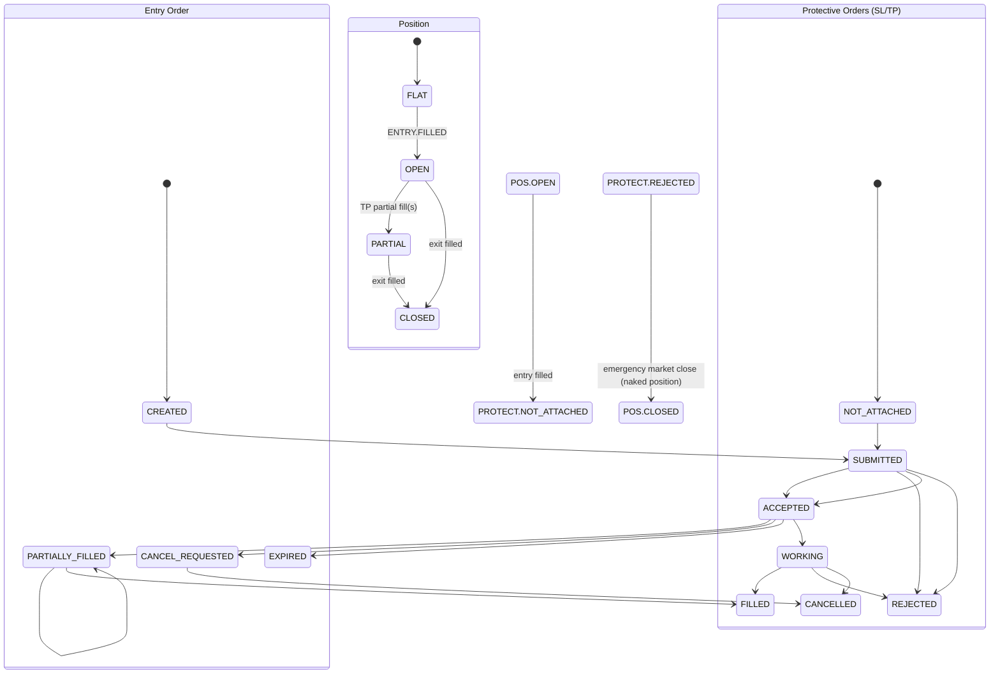

# Phase 05 (Agent A) Findings: Trade Manager

**Scope:** Trade lifecycle/state logic review for:
- `/home/franco/projetos/EA_SCALPER_XAUUSD/nautilus_gold_scalper/src/execution/trade_manager.py`

**Focus (per Phase 05 plan):** lifecycle completeness, state machine, SL/TP attachment & rejection handling, emergency close path, Apex time gates (16:30 block / 16:55 emergency / 16:59 hard flat ET), out-of-sequence events, partial fills.

---

## Executive Verdict

`TradeManager` is a **local, in-memory trade tracker** with a small trade-level state machine and “action suggestions” (`take_partial`, `adjust_sl`) but **no order/position lifecycle integration**. It cannot be used as an execution-grade trade manager for Apex/Tradovate/NinjaTrader because it:

- does **not** model or track entry/SL/TP orders (no order IDs, no ack/fill/reject states)
- does **not** attach protective orders (SL/TP) or verify they are accepted
- has **no rejection/partial-fill/out-of-sequence event handling contract**
- has **no time-gate or emergency-close orchestration**

Also, this module appears **unused** in the codebase (exported in `src/execution/__init__.py` but not imported/used elsewhere), which reduces immediate production risk but indicates the execution layer is incomplete or split across other modules.

---

## Architecture Snapshot (What This Module Actually Does)

### Data model
- `TradeInfo`: stores entry price, SL/TP levels, quantity, extremes (highest/lowest), timestamps, realized PnL, and `TradeState`.

### Public API
- `create_trade(...)` → creates `TradeInfo` in `TradeState.PENDING`
- `fill_entry(trade_id, actual_entry_price, actual_quantity)` → sets `TradeState.OPEN` and resets extremes
- `update_price(trade_id, current_price)` → returns an **actions dict** (`take_partial`, `adjust_sl`) and may update trade state (`OPEN → BREAKEVEN → TRAILING`)
- `execute_partial(...)` → decrements quantity, increments `partial_count`, moves to `PARTIAL_CLOSE` or `CLOSED`
- `adjust_stop_loss(...)` → updates `current_sl` in-memory (no execution confirmation)
- `close_trade(...)` → marks `CLOSED` and computes remaining PnL (if `pnl` not supplied)

No method in this module submits/cancels/modifies orders or reconciles broker events.

---

## State Machine Diagram (As Implemented)

This diagram reflects **trade-level** state transitions implied by the code paths. Important note: several transitions are possible because methods do not gate by state (e.g., `execute_partial`, `adjust_stop_loss`, `close_trade`).

```mermaid
stateDiagram-v2
    [*] --> PENDING: create_trade()

    PENDING --> OPEN: fill_entry()
    PENDING --> CLOSED: close_trade() (allowed; no cancel state)

    OPEN --> BREAKEVEN: update_price() && r>=trailing_start_r && SL moved
    OPEN --> OPEN: update_price() otherwise

    BREAKEVEN --> TRAILING: update_price() && r>=trailing_start_r
    BREAKEVEN --> BREAKEVEN: update_price() && r<trailing_start_r

    OPEN --> PARTIAL_CLOSE: execute_partial() && remaining_qty>0
    BREAKEVEN --> PARTIAL_CLOSE: execute_partial() && remaining_qty>0
    TRAILING --> PARTIAL_CLOSE: execute_partial() && remaining_qty>0
    PARTIAL_CLOSE --> PARTIAL_CLOSE: execute_partial() && remaining_qty>0

    OPEN --> CLOSED: close_trade()
    BREAKEVEN --> CLOSED: close_trade()
    TRAILING --> CLOSED: close_trade()
    PARTIAL_CLOSE --> CLOSED: close_trade()

    OPEN --> CLOSED: execute_partial() && remaining_qty==0
    BREAKEVEN --> CLOSED: execute_partial() && remaining_qty==0
    TRAILING --> CLOSED: execute_partial() && remaining_qty==0
    PARTIAL_CLOSE --> CLOSED: execute_partial() && remaining_qty==0

    TRAILING --> TRAILING: update_price() && SL moves
    PARTIAL_CLOSE --> TRAILING: update_price() && SL moves

    %% Defined in enum but unreachable here
    PENDING --> CANCELLED: (no API)
    OPEN --> CANCELLED: (no API)
```

**State machine completeness status:** complete for the **implemented trade-level states**, but **does not include order/position transitions** because they are not represented in this module.

---

## Required Order/Position Lifecycle (Missing From This Module)

The Phase 05 requirement expects an execution-grade lifecycle including order submission, acknowledgements, fills (including partial), rejections, cancels, expiries, and protective-order failure recovery. That lifecycle is not present here.

A minimal required lifecycle (conceptual) to support real execution:

---

## Findings (Prioritized)

### CRITICAL

1) **No SL/TP attachment or rejection handling**
- TradeInfo tracks SL/TP prices, but there is no order submission/ack/reject path for protective orders.
- `adjust_stop_loss()` updates in-memory state without verifying execution success.
- Impact: a position can be effectively **naked** (no broker-side SL) with no detection/recovery.

2) **No order/position lifecycle model**
- There are no order IDs, order states, or translation of broker events.
- The `TradeState` enum is trade-level only and cannot express submit/ack/reject/cancel/expire/partial-fill flows.

3) **No emergency-close/time-gate orchestration**
- No ET time awareness; no interface to enforce 16:30 entry block or 16:55/16:59 flatten behavior.
- `close_trade()` is internal bookkeeping, not guaranteed execution.

4) **Partial fill support is incomplete**
- `fill_entry()` assumes a single fill event; it overwrites entry price and quantity.
- No support for multiple partial fills, average fill price tracking, or remaining-order reconciliation.

5) **Out-of-sequence/duplicate events not handled**
- `fill_entry()` raises if state is not `PENDING` (no idempotency or dedupe).
- `execute_partial()` and `close_trade()` have no state preconditions; invalid transitions are possible.

6) **No SL/TP hit detection or exit action emission**
- `update_price()` does not check price vs `current_sl`/TP levels and never emits `close_position`.
- This module cannot drive trade closure in a simulation unless closure is handled externally.

### HIGH

7) **`CANCELLED` state is unreachable**
- `TradeState.CANCELLED` exists, and `get_active_trades()` filters it, but there is no API which sets it.

8) **Input validation gaps in `update_price()`**
- No guard that `current_price > 0` or is non-NaN; corrupted ticks can skew extremes and R calculations.

9) **Price/tick-size correctness is not enforced**
- Breakeven buffer is a hardcoded `0.02` and trailing SL is not snapped to tick size.
- If used with venues enforcing price increments, this can lead to rejected modifications.

### MEDIUM

10) **Type/precision mixing (Decimal + float)**
- Quantities are `Decimal` but prices and PnL are floats; `close_trade()` converts `Decimal` to float.

11) **TP ladder fields are present but unused**
- `take_profit_1/2/3` are stored but do not influence actions or closure logic.

---

## Edge Case Matrix (Expected vs Actual)

| Scenario | Expected (execution-grade) | Actual in `TradeManager` | Severity |
|---|---|---|---|
| Entry fill arrives twice (duplicate broker event) | idempotent handling / ignore duplicate | raises `ValueError` on second call | CRITICAL |
| Fill arrives before create/ack (out-of-sequence) | queue/reconcile based on order IDs | cannot reconcile (no order IDs) | CRITICAL |
| Entry partially fills over multiple events | track cumulative qty + avg price; keep remaining order open | only one `fill_entry()` overwrite | CRITICAL |
| SL order rejected while position open | emergency market close + halt | not representable | CRITICAL |
| Approaching 16:55 ET with open position | start emergency close loop with retries | no time awareness | CRITICAL |
| Price hits SL/TP | broker protective order fills; trade closes | no detection; relies on external system | CRITICAL |
| Stale PENDING trade (never filled) | cancel/expire and mark cancelled | no cancel/expire path | HIGH |
| Bad tick (0/negative/NaN price) | reject tick / keep state safe | extremes and R can corrupt | HIGH |

---

## Notes on Temporal Correctness and Performance

- Temporal correctness: `update_price()` uses only current price and stored past state; no look-ahead risk in this module.
- Performance: operations are O(1) per call and should be well below 1ms.

---

## Conclusion

This `TradeManager` is suitable only as a **toy/simulation helper** unless paired with a robust execution/order lifecycle component. For Phase 05, the key audit conclusion is that the module **does not meet** the plan’s execution-grade requirements for order lifecycle, protective order management, rejection recovery, and Apex time-gate emergency flattening.
